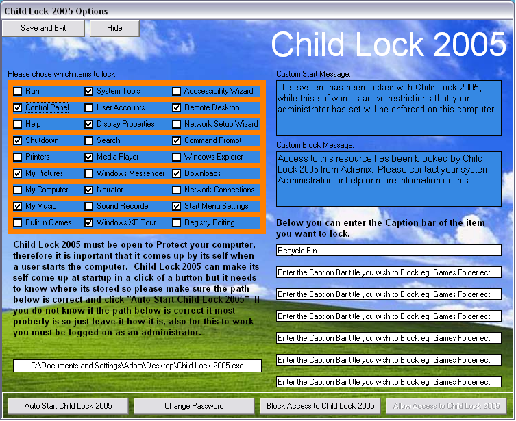



## Child Lock 2005

### Description

This is a follow on from Protect 2005, with this code you can bar over 30 parts of Windows to prevent kids from messing up your computer, by blocking access to Control Panel, My Computer ect. a lot of your settings can not be change, the softwares security can be overided with a password. Please download as it is full of features. I am only 15 and this took a long time to make so PLEASE VOTE and LEAVE COMMENTS. Thank you.
 
### More Info
 

             |
---                |---
**Submitted On**   |2005-02-12 16:42:24
**By**             |[Adam Ranshaw](https://github.com/Planet-Source-Code/PSCIndex/blob/master/ByAuthor/adam-ranshaw.md)
**Level**          |Intermediate
**User Rating**    |4.4 (40 globes from 9 users)
**Compatibility**  |VB 5\.0, VB 6\.0
**Category**       |[Registry](https://github.com/Planet-Source-Code/PSCIndex/blob/master/ByCategory/registry__1-36.md)
**World**          |[Visual Basic](https://github.com/Planet-Source-Code/PSCIndex/blob/master/ByWorld/visual-basic.md)
**Archive File**   |[Child\_Lock1851952122005\.zip](https://github.com/Planet-Source-Code/adam-ranshaw-child-lock-2005__1-58865/archive/master.zip)

